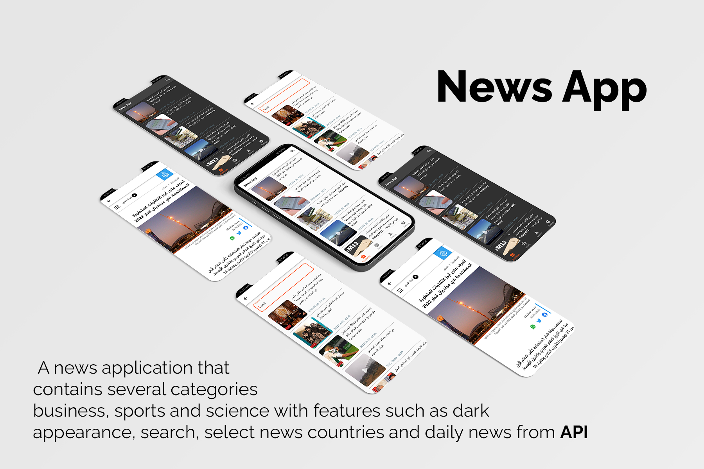
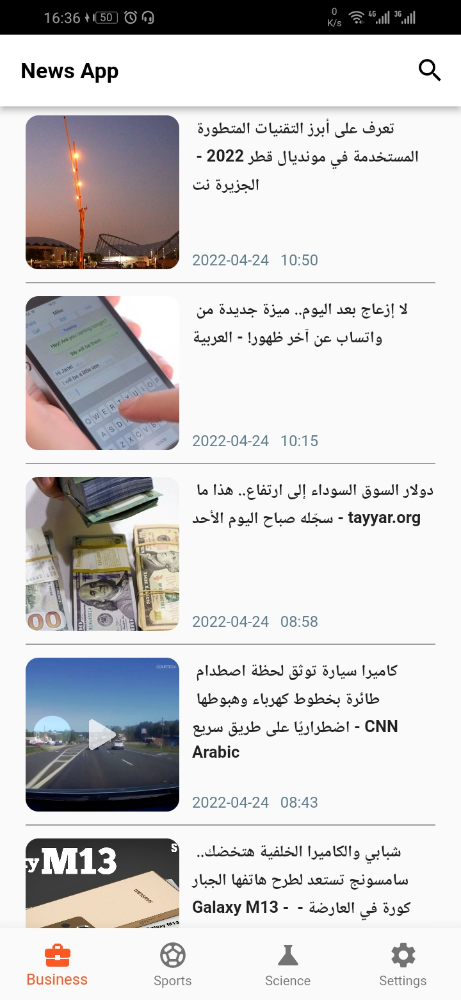
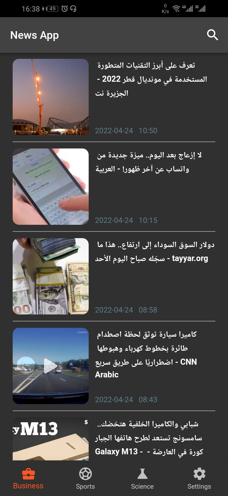
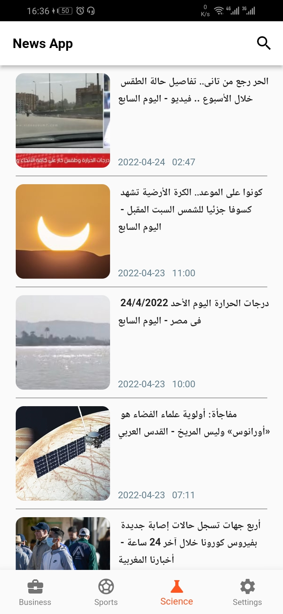
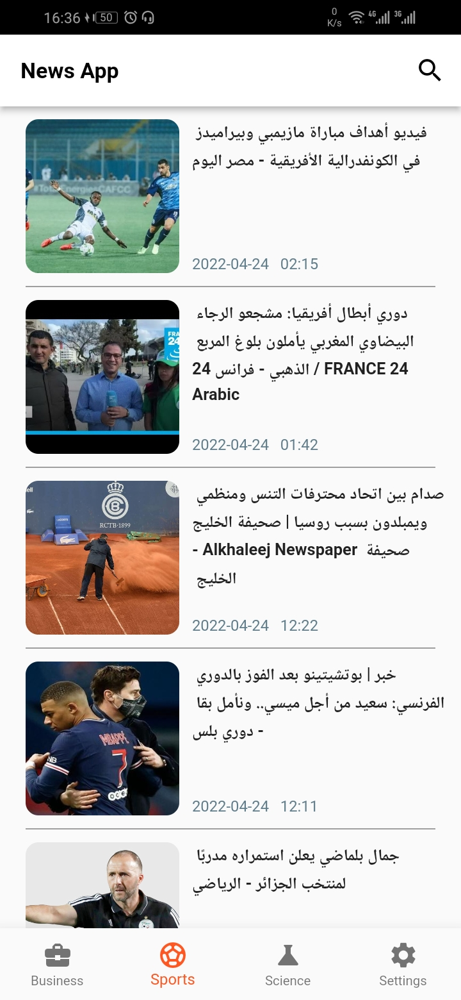
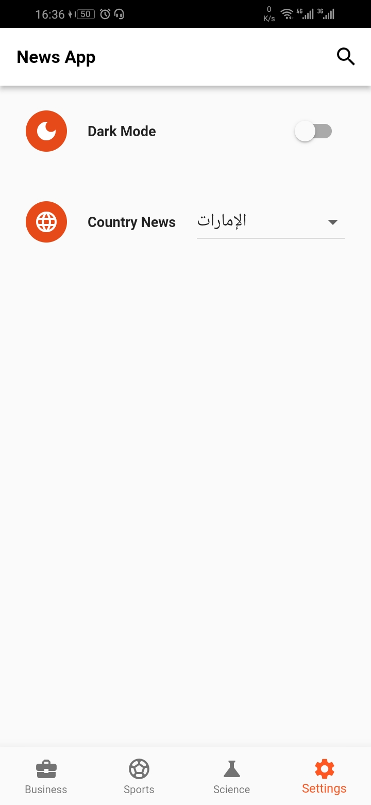
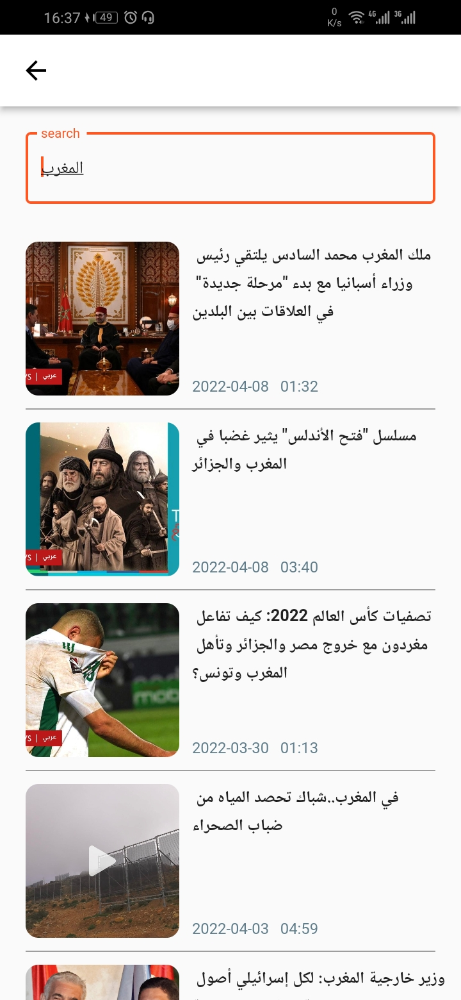
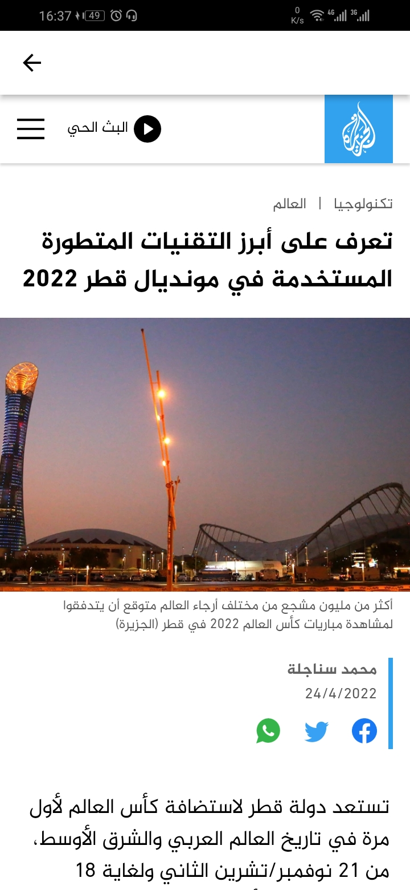

#  News App ✨

News is open-source  app for Android & ios. It is built with Flutter Framework.

Star ⭐ the repo if you like it.

## Features

 - Daily News 
 - Categories Business & Sport & Science
 - Multi Country
 - Dark Theme
 - Search News

## Snapshots 

| Business Screen | Dark Theme |
|------|-------|
|||

| Science Screen | Sport  Screen |
|------|-------|
|||

| Settings Screen | Search  Screen |
|------|-------|
|||

| Web View Screen |
|------|
||

## Dependencies 
 -  `bloc`
 -  `flutter_bloc`
 -  `dio`
 -  `intl`
 -  `shared_preferences`
 -  `webview_flutter`

 ## My Social Media

